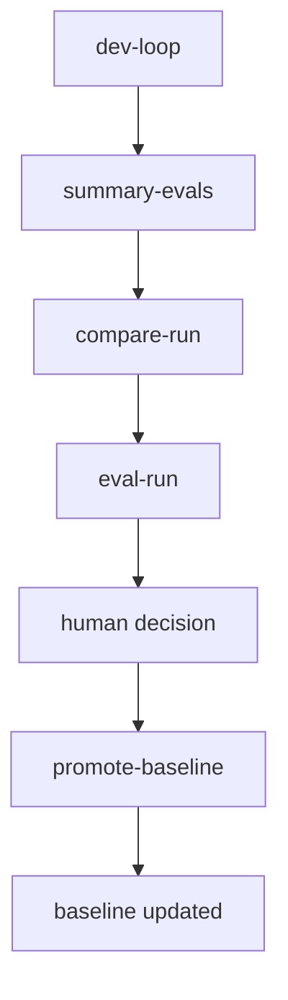
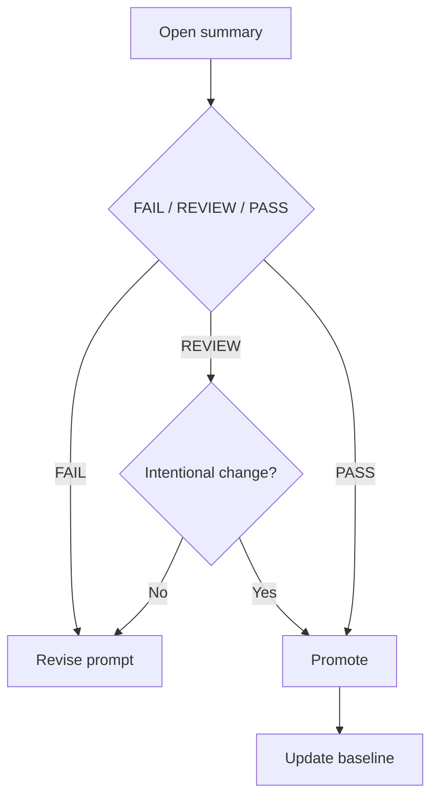
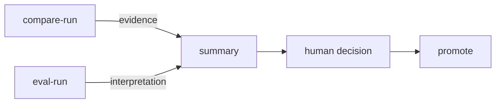
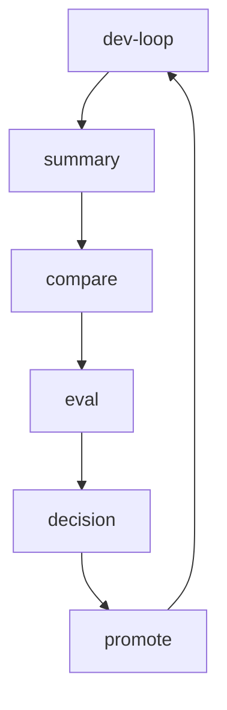

# 📘 Prompt Regression Framework

> Local-first prompt regression framework with human-in-the-loop evaluation. Safe prompt evolution over blind optimization.

---

## 🚀 Overview

A local framework for **safe prompt evolution** using:

- regression testing
- structured comparison
- human-in-the-loop evaluation

---

## 🎯 Goal

Enable continuous prompt improvement **without breaking existing behavior**.

- Prevent unintended regressions  
- Provide evidence-based comparison  
- Keep final decision with human  

---

## 🧠 Core Principles

- compare = evidence  
- eval = interpretation  
- human = decision  
- promote = action  

- backward compatibility preferred  
- minimal-change updates preferred  

---

## 🔄 Execution Flow



---

## ⚡ Daily Usage

### 1. Run dev-loop

```powershell
./scripts/dev-loop.ps1 -SuiteId TS-0001
```

---

### 2. Open summary

```
evals/YYYY-MM-DD/summary.txt
```

---

### 3. Review FAIL / REVIEW

Focus on:

- missing information
- format differences
- behavior changes

---

### 4. Run compare / eval

```powershell
./scripts/compare-run.ps1 -RunId RUN_xxx
./scripts/eval-run.ps1 -RunId RUN_xxx
```

---

### 5. Make decision (Human)

#### DECISION GUIDE

- FAIL → Not acceptable (fix prompt)
- REVIEW → Accept if intentional change
- PASS → Safe to promote

---

### 6. Promote (if accepted)

```powershell
./scripts/promote-baseline.ps1 -RunId RUN_xxx
```

---

## 🧭 Decision Flow



---

## 🧠 Responsibility Separation



---

## 🧩 Key Scripts

| Script | Role |
|------|------|
| dev-loop.ps1 | Entry point |
| summary-evals.ps1 | Navigation |
| compare-run.ps1 | Evidence |
| eval-run.ps1 | Interpretation |
| promote-baseline.ps1 | Approval |

---

## 🛡 Safety Design

- Human-in-the-loop decision  
- Strict responsibility separation  
- Baseline-based regression  
- Robust against partial artifacts  

---

## 🔁 Loop



---

## ✨ Philosophy

> Safe evolution over blind optimization

- Keep prompts evolvable  
- Keep behavior stable  
- Keep humans in control  
