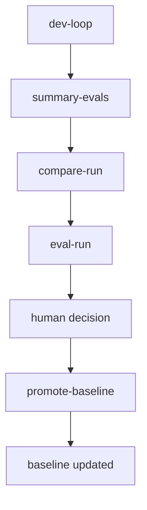
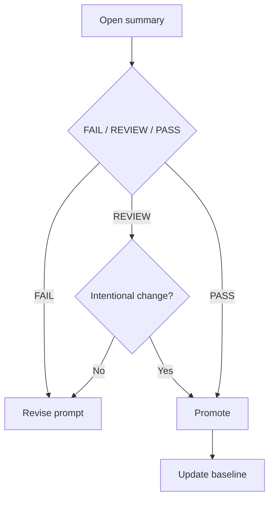
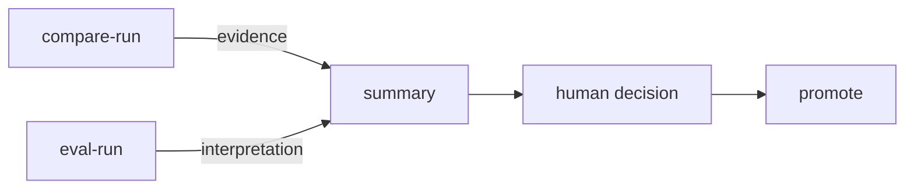
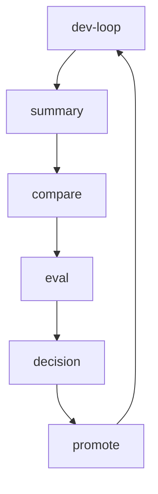

# 📘 Prompt Regression Framework

> Local-first prompt regression framework with human-in-the-loop evaluation. Safe prompt evolution over blind optimization.

> Test prompts like code. Catch regressions before they reach production.

---

## 🚀 Overview

A local framework for **safe prompt evolution** using:

- regression testing
- structured comparison
- human-in-the-loop evaluation

---

## 🎯 Goal

Enable continuous prompt improvement **without breaking existing behavior**.

- Prevent unintended regressions  
- Provide evidence-based comparison  
- Keep final decision with human  

---

## 🧠 Core Principles

- compare = evidence  
- eval = interpretation  
- human = decision  
- promote = action  

- backward compatibility preferred  
- minimal-change updates preferred  

---

## 🔄 Execution Flow



---

## 🆕 First Run Behavior (Important)

On the first run, no baseline exists yet.

```
compareStatus = BASELINE_MISSING
recommendedVerdict = REVIEW
```

This is **expected behavior**.

👉 It means:

- Comparison is not yet available  
- The output is a **candidate for initial baseline**  

---

## 🔍 What does REVIEW mean?

REVIEW does NOT mean failure.

- Human confirmation is required  
- Changes may be acceptable  
- Baseline may be updated if intentional  

---

## Included sample prompts

This repository includes minimal sample prompts so that the default example suite can run immediately after clone.

## First run note

On the very first accepted run, create the initial baseline with:

```powershell
./scripts/promote-baseline.ps1 -RunId RUN_xxx
```

Comparison starts from the second approved run onward.

---

## ⚡ Daily Usage

### 1. Run dev-loop

```powershell
./scripts/dev-loop.ps1 -SuiteId TS-0001
```

---

### 2. Open summary

```
evals/YYYY-MM-DD/summary.txt
```

---

### 3. Review FAIL / REVIEW

Focus on:

- missing information
- format differences
- behavior changes

---

### 4. Run compare / eval

```powershell
./scripts/compare-run.ps1 -RunId RUN_xxx
./scripts/eval-run.ps1 -RunId RUN_xxx
```

---

### 5. Make decision (Human)

#### DECISION GUIDE

- FAIL → Not acceptable (fix prompt)
- REVIEW → Accept if intentional change
- PASS → Safe to promote

---

### 6. Promote (if accepted)

```powershell
./scripts/promote-baseline.ps1 -RunId RUN_xxx
```

---

## 📦 Baseline Management

### INITIAL_CREATE

- Establish the first baseline  
- Accept current output as reference  

### UPDATE

- Replace existing baseline  
- Requires intentional decision (`-Force`)  

---

## 🧭 Decision Flow



---

## 🧠 Responsibility Separation



---

## 🧩 Key Scripts

| Script | Role |
|------|------|
| dev-loop.ps1 | Entry point |
| summary-evals.ps1 | Navigation |
| compare-run.ps1 | Evidence |
| eval-run.ps1 | Interpretation |
| promote-baseline.ps1 | Approval |

---

## 🛡 Safety Design

- Human-in-the-loop decision  
- Strict responsibility separation  
- Baseline-based regression  
- Robust against partial artifacts  

---

## 🔁 Loop



---

## ✨ Philosophy

> Safe evolution over blind optimization

- Keep prompts evolvable  
- Keep behavior stable  
- Keep humans in control  

---

## 🚀 Quick Start (First 5 Minutes)

Follow this path if you are new:

### 1. Run a test case

```powershell
./scripts/run-case.ps1 -CaseId TC-0001
```

---

### 2. Open the generated prompt and response

```
runs/RUN_xxx/response.txt
```

Fill in the response (or use an LLM).

---

### 3. Compare and evaluate

```powershell
./scripts/compare-run.ps1 -RunId RUN_xxx
./scripts/eval-run.ps1 -RunId RUN_xxx
```

---

### 4. Review summary

```powershell
./scripts/summary-evals.ps1 -RunDate YYYY-MM-DD
```

You will see:

```
REVIEW | Initial baseline review candidate
```

---

### 5. Promote baseline (first time)

```powershell
./scripts/promote-baseline.ps1 -RunId RUN_xxx
```

---

### 6. Make a change using MIG

```powershell
./scripts/new-mig.ps1 -Name MIG-0001
```

Edit the MIG to change behavior.

---

### 7. Run again and observe differences

Repeat steps 1–4.

---

### 8. Decide

- If change is correct → promote
- If not → revise MIG

---

## ⚠️ First-Time Setup (PowerShell Execution Policy)

When running the scripts for the first time, you may encounter an error due to PowerShell's execution policy restrictions.

To allow script execution for the current session, run the following command:

```powershell
Set-ExecutionPolicy -Scope Process -ExecutionPolicy Bypass
```

After that, try running the script again.

> Note: This setting applies only to the current PowerShell session and will be reset when you close the terminal.
